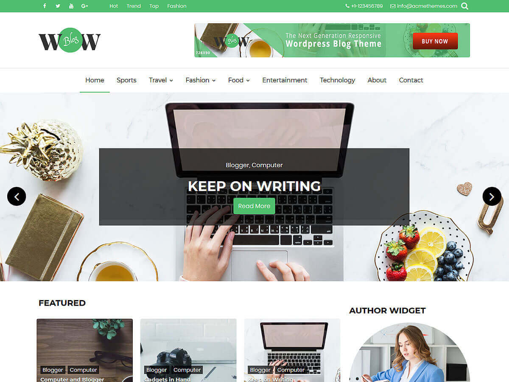

# WOW Blog

**Contributors:** acmethemes  
**Requires at least:** 6.6  
**Tested up to:** 7.0  
**Requires PHP:** 7.4  
**Stable tag:** 2.0.0  
**License:** GPLv2 or later  
**License URI:** https://www.gnu.org/licenses/gpl-2.0.html  

> 

WOW Blog is a child theme of [Read More](https://wordpress.org/themes/read-more/), designed for bloggers who want a fresh, modern look with added personality. It inherits the clean, reader-friendly foundation of its parent while adding distinctive design touches — updated button styles, header advertisement support, and refined post layouts.

> **Note:** WOW Blog requires [Read More](https://wordpress.org/themes/read-more/) to be installed and activated first.

## Features

- **Updated button design** — modern, eye-catching call-to-action buttons
- **Header advertisement** — monetize your blog with ad placements
- **Refined site identity placement** — improved logo and tagline layout
- **Customized related post display** — redesigned title and placement
- **Responsive slider** — showcase featured content beautifully
- **Category color options** — color-code your blog categories
- **Header image/video** — personalized hero area
- **Unlimited pages on section** — flexible content areas

All features of **Read More** are also available, including:
- Clean reading experience, customizer controls, author widget, social icons, breadcrumbs, WooCommerce support, and more.

## Installation

1. First, install and activate [Read More](https://wordpress.org/themes/read-more/).
2. Download the WOW Blog theme zip file.
3. In your WordPress admin, go to **Appearance → Themes**.
4. Click **Add New** → **Upload Theme**.
5. Select the zip file and click **Install Now**.
6. Click **Activate**.

## Frequently Asked Questions

### How do I set up the front page?

Create a new page in **Pages → Add New**, go to **Settings → Reading**, and set it as the static front page. The "Home Main Content Area" sidebar will display on the homepage.

### How do I customize the theme?

Go to **Appearance → Customize** to adjust layout, colors, header, and widgets.

## Credits

WOW Blog is a child theme of [Read More](https://wordpress.org/themes/read-more/) and is licensed under GPLv2 or later. It uses the same third-party resources as its parent theme.

---

[Support](https://www.acmethemes.com/supports/) &middot; [Acme Themes](https://www.acmethemes.com)
